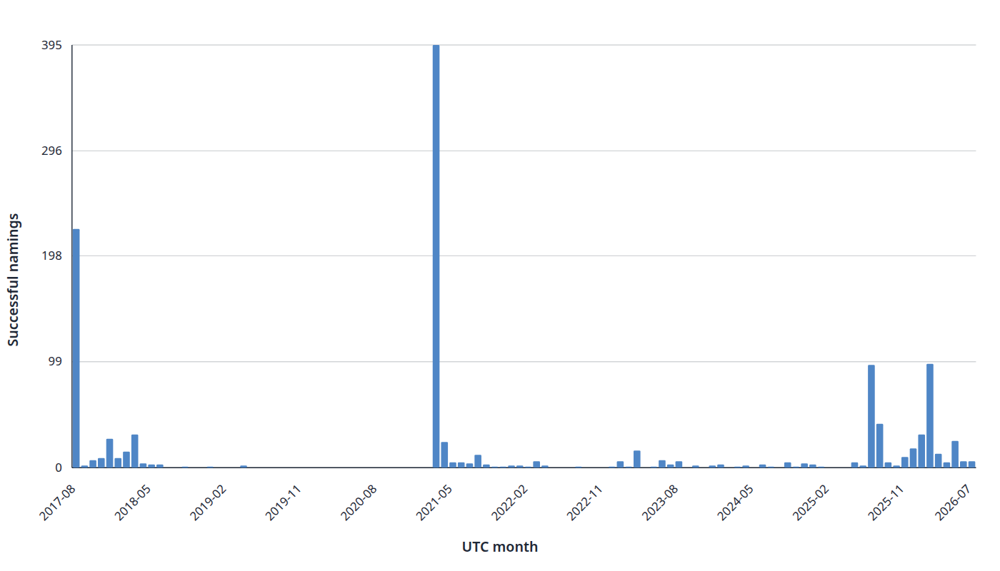

# MoonCat name index

This repository indexes `CatNamed` events from the original MoonCatRescue
contract. The event JSONL is canonical; current-name JSON artifacts are
derived from that event history. `data/seed/current-names.json` is a historical
comparison reference only and is never merged into canonical events.

## License

Original project code and documentation are licensed under the GNU General
Public License version 3 or any later version (SPDX: `GPL-3.0-or-later`); see
[LICENSE](LICENSE).

Bundled third-party and upstream reference material under `references/` remains
subject to its own original licenses and terms and is not relicensed by this
repository. Generated and on-chain data is offered under
`GPL-3.0-or-later` to the extent copyright or related rights apply; this does
not claim ownership of the underlying blockchain facts.

## One backfill batch

Set `MOONCAT_RPC_URL` (preferred) or `ETH_RPC_URL`, then run one bounded batch:

```sh
npm run backfill -- --max-blocks 100000
```

The default batch limit is 100,000 blocks. `--max-blocks` controls the outer
backfill window and is independent of the checkpoint's RPC `chunkSize`.
Each batch scans from the canonical naming start block (`4,140,409`) for a new
checkpoint, or from the existing overlap resume point thereafter. It clamps
the target to the finalized block (`latest - confirmations`) and never queries
unfinalized history.

The command emits one JSON object. It uses the existing atomic persistence
pipeline in this order:

```text
events -> current-name artifacts -> checkpoint
```

An interruption is safe to retry. Event IDs make overlap retries idempotent,
and a checkpoint advances only after the event and artifact writes succeed.

## Full resumable backfill

Use the foreground loop after testing a single batch:

```sh
npm run backfill:all -- --max-blocks 100000
```

The loop stops when the finalized target is reached or when an invocation
makes no progress. It does not busy-loop on a stalled RPC or an already
persisted range. All canonical path overrides are available on both commands:
`--checkpoint`, `--events`, `--current-names`, `--names-by-cat-id`,
`--names-by-rescue-order`, and `--metadata`.

Public RPC services commonly limit `eth_getLogs` range size, request rate, and
historical availability. Lower `--max-blocks` when a provider rejects a batch;
the checkpoint's `chunkSize` still bounds each individual logs request. A
provider failure leaves the last durable checkpoint available for restart.

## Validation

```sh
npm test
npm run check
npm run validate:current-names
```

The backfill tests use mocked block/log clients and persistence dependencies;
they do not perform live RPC calls.

## CatMoon compatibility names

`data/names-simple.json` is a derived display compatibility artifact with the
shape `{ "6": "mister moo" }` consumed by CatMoon. It uses decimal rescue-order
keys and includes only canonical current-name records with a string `text`
field, including rescue order 4420's redacted replacement-character display.
Invalid UTF-8 and leading-null records remain available in the detailed
canonical artifacts but are omitted from this simple map. The map is not the
canonical source of truth; `data/events.jsonl` and the detailed current-name
artifacts retain raw bytes and status information. `npm run validate:current-names`
checks its exact bytes along with the other current-name artifacts.

## Naming order and block time metadata

Canonical nonblank events may carry `blockTimestamp` as Unix seconds. Current
name records derive `namedOrder` from block number, transaction index, and log
index, and publish it as a 1-based human-readable value. `namedYear` is the
four-digit UTC year derived from that block timestamp. Blank attempts remain in
the event history but do not receive naming-order metadata.

To enrich an existing event store in bounded, resumable batches, configure
`MOONCAT_RPC_URL` or `ETH_RPC_URL` and run:

```sh
npm run enrich:timestamps -- --max-blocks 250
```

The command fetches each unique missing nonblank event block once per run,
persists events before regenerating detailed artifacts, and can be rerun until
`remainingBlockCount` is zero. New logs discovered by scans and backfills use
the same RPC block-timestamp enrichment path before persistence. The historical
seed is not used as a timestamp source.

## Namer transaction metadata

Canonical nonblank naming events and detailed current-name artifacts may carry
`namer`, the immediate Ethereum transaction `from` address. It is checksum
normalized and may identify either a wallet or a contract; it does not identify
the human chooser or beneficial owner, and no EOA/contract classification is
stored.

To enrich existing events without rescanning CatNamed logs, configure
`MOONCAT_RPC_URL` or `ETH_RPC_URL` and run the bounded, resumable command:

```sh
npm run enrich:namers -- --max-transactions 250
```

Each unique missing transaction hash is fetched at most once per run. The
command persists enriched events before regenerating detailed artifacts and
reports `remainingTransactionCount`; rerun it until that count is zero. Future
scans and backfills fetch both block timestamps and transaction senders before
their events are persisted.

## Automated publishing

The production wake-up path is an Alchemy Custom Webhook to a small Cloudflare
Worker, then GitHub Actions. The Worker validates the raw-body signature,
strictly normalizes one matching `CatNamed` log, and dispatches only that
bounded provisional event; it never treats webhook data as finalized
canonical input. Repository dispatch publishes `data/pending-events.json` and
the explicit `*-live.json` artifacts immediately. A separate reconciliation
job waits about 15 minutes for repository dispatch, scans the existing
64-confirmation finalized range, promotes confirmed events, removes orphaned
pending entries, and refreshes both finalized and live artifacts. Manual and
six-hour scheduled runs reconcile immediately without the wait.

Finalized consumers should continue reading `data/events.jsonl`,
`data/current-names.json`, `data/names-by-cat-id.json`,
`data/names-by-rescue-order.json`, `data/names-simple.json`, and
`data/metadata.json`; these retain their finalized-only meaning. Live
consumers may opt into `data/pending-events.json` and the five `*-live.json`
artifacts. Live metadata identifies finalized and provisional counts, and
provisional current-name records carry `provisional: true`. Blank provisional
events contribute to live pending metadata but never create a current-name
record. Duplicate deliveries are idempotent, and finalized-height entries
missing from RPC logs are removed as reorg/orphan candidates.
Provisional publication and reconciliation use separate serialized job lanes,
so a reconciliation wait does not block later provisional deliveries. Their
short main-branch writes fetch/rebase and retry; an unresolvable race fails
without overwriting newer commits.
Publishing commits those generated artifacts directly to `main`; it does not
open a pull request. Repository branch rules therefore need to permit the
workflow's normal push while still blocking force pushes and branch deletion.

Deployment, required secrets, Alchemy filter setup, manual dispatch testing,
checkpoint cache behavior, and recovery steps are documented in
[docs/automated-publishing.md](docs/automated-publishing.md).

## Monthly naming timeline

Generate and validate the deterministic UTC-month timeline derived from the
canonical event history:

```sh
npm run generate:naming-timeline
npm run validate:naming-timeline
```

The graph includes only nonremoved, successful nonblank naming events with a
valid canonical `blockTimestamp`. Blank attempts are explicitly excluded, and
the artifact includes zero-count months between its first and last included
month. To view the dependency-free page, serve the repository root over HTTP,
for example `python3 -m http.server 8000`, then open
`http://localhost:8000/timeline/`. A generated static preview is embedded
below; [open the interactive timeline](timeline/) for the accessible chart.



The source remains `data/events.jsonl`; no live RPC or clock-derived fields are
used during generation.

## Seed comparison

Compare only the committed canonical current-name artifact with the historical
seed:

```sh
npm run compare:seed
npm run validate:seed-comparison
```

The report is `reports/seed-comparison.json`. `--check` performs an exact-byte
comparison and the report contains no clock-derived fields. Its categories are
objects keyed as `<catId>@<rescueOrder>`:

- `exactMatches`: canonical and seed raw/status/text values agree.
- `canonicalOnly`: a canonical current name has no seed record.
- `seedOnly`: a seed record has no canonical current name.
- `mismatches`: both records exist but their raw/status/text values differ.

Each category retains canonical or seed details, including raw bytes and
decoded status/text where available. The current report has 1,225 exact
matches, seven `canonicalOnly` records, and zero `seedOnly` records or
mismatches. See [the seed reconciliation note](docs/seed-reconciliation.md)
for the seven records and the evidence limits around seed coverage.
